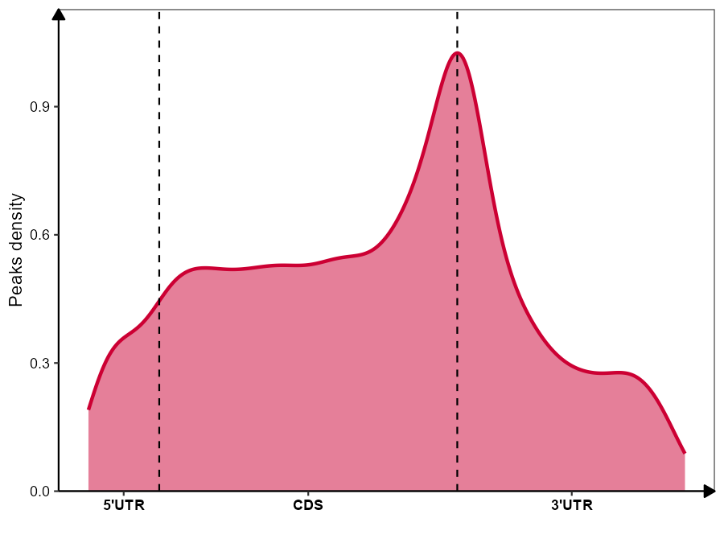
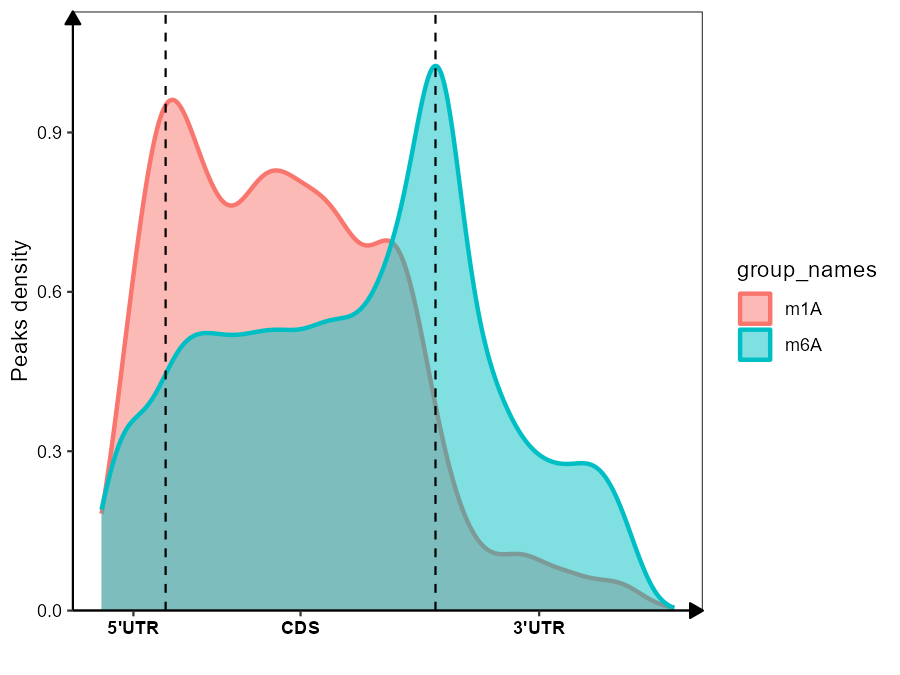
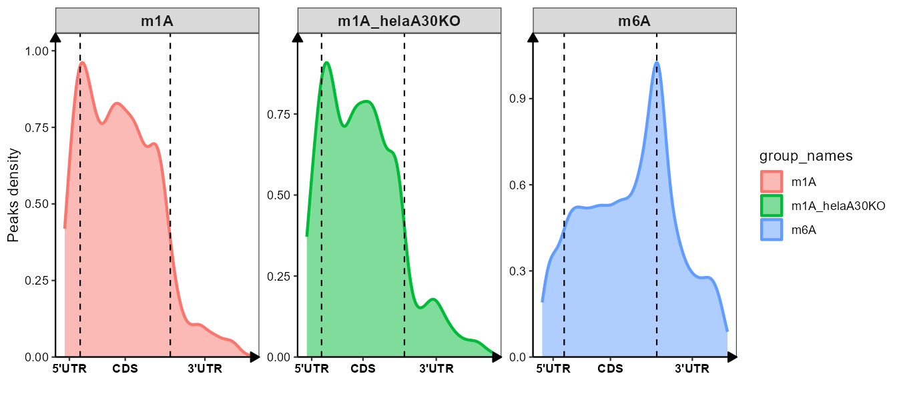

# metaplot

<!-- badges: start -->

Visualize m6A (or other RNA modification) peaks distribution across 5'UTR, CDS and 3'UTR regions.

<!-- badges: end -->

---

## Installation

You can install the development version of metaplot like so:

``` r
# install.packages("devtools")
devtools::install_github("junjunlab/metaplot")

# or
remotes::install_github("junjunlab/metaplot")
```

---

## Usage

The typical workflow is: annotate transcript features from a GTF file with
`prepare_features()`, then feed one or more peak BED files into `metaPlot()`
to get a meta-gene density plot.

The package ships with a small hg38 RefSeq GTF and example m6A/m1A peak BED
files under `inst/extdata`, so every example below can be copy-pasted and run
as-is right after installing the package.

``` r
library(metaplot)

gtf_file   <- system.file("extdata", "hg38.ncbiRefSeq.gtf.gz", package = "metaplot")
m6a_bed    <- system.file("extdata", "m6a_peaks.bed", package = "metaplot")
m1a_bed    <- system.file("extdata", "m1a.sorted2.bed", package = "metaplot")
helako_bed <- system.file("extdata", "helaA30ko-1.m1a.sorted2.bed", package = "metaplot")
```

### 1. Prepare transcript features from a GTF file

`prepare_features()` reads a GTF file, keeps the longest transcript per gene,
and extracts 5'UTR/CDS/3'UTR coordinates as a `GRanges` object.

``` r
# Ensembl-style GTF uses the default feature names
# features_anno <- prepare_features(gtf_file = "your_ensembl.gtf.gz")

# the bundled GTF is UCSC/RefSeq-style, which uses different feature labels
features_anno <- prepare_features(
  gtf_file = gtf_file,
  features_name = c("5UTR", "CDS", "3UTR")
)
```

`features_anno` only needs to be computed once per genome/annotation and can
be reused across multiple `metaPlot()` calls.

### 2. Meta-gene plot for a single sample

``` r
res <- metaPlot(
  bed_file = list(m6a_bed),
  group_names = "m6A",
  features_anno = features_anno,
  scale_region = TRUE
)

res$plot        # ggplot object
head(res$data)  # data frame with relative positions used for plotting
```



Setting `scale_region = TRUE` rescales the 5'UTR and 3'UTR widths relative to
the median CDS length (rather than treating all three regions as equal
width), which better reflects real transcript proportions. You can also
supply a custom ratio instead of the automatically estimated one:

``` r
res <- metaPlot(
  bed_file = list(m6a_bed),
  group_names = "m6A",
  features_anno = features_anno,
  scale_region = TRUE,
  cut_ratio = c(0.1, 0.8, 0.1)
)
```

### 3. Compare multiple samples / modifications

`bed_file` accepts a list of BED file paths (or in-memory `data.frame`/
`GRanges` objects), letting you overlay several groups on one plot:

``` r
res <- metaPlot(
  bed_file = list(m6a_bed, m1a_bed),
  group_names = c("m6A", "m1A"),
  features_anno = features_anno,
  scale_region = TRUE
)

res$plot
```



Use `facet = TRUE` to draw each group in its own panel instead of overlaying
densities — handy when comparing more than two groups:

``` r
res_facet <- metaPlot(
  bed_file = list(m6a_bed, m1a_bed, helako_bed),
  group_names = c("m6A", "m1A", "m1A_helaA30KO"),
  features_anno = features_anno,
  scale_region = TRUE,
  facet = TRUE
)

res_facet$plot
```



### 4. Motif analysis around peaks (optional, requires Python)

For motif-centric analyses (e.g. checking whether the m6A "RRACH" motif is
enriched at the peak center), `metaplot` provides a small set of
`reticulate`-based helpers. These need a genome FASTA file, which isn't
bundled with the package, so replace `"genome.fa"` with your own reference:

``` r
# 1. extract peak sequences from a genome FASTA
getSeqFromBed(
  peak = m6a_bed,
  genomefie = "genome.fa",
  outfasta = "peaks.fa",
  type = "bed",
  a = 25, b = 25   # extend 25 bp up/downstream of each peak
)

# 2. find motif occurrences in the extracted sequences
findMotif(peaksfa = "peaks.fa")

# 3. calculate each motif's position relative to the peak center
rel_dist <- CalculatePeaksRelativeDist(peaksfa = "peaks.fa")

# 4. plot the motif's relative distribution for one or more samples
plotRelMotif(
  relpos = list(rel_dist),
  exp = "m6A"
)
```

These functions require a working Python installation with the `re` and
`pyfaidx` modules; pass `pythonPath` to point at a specific interpreter if
needed.

---

## Citation

> Jun Zhang (2024). *Visualizing m6A Distribution on RNA.*  https://github.com/junjunlab/metaplot

---

## Related blogs

[写个包 metaplot 绘制 m6A peak 分布](https://mp.weixin.qq.com/s?__biz=MzkyMTI1MTYxNA==&mid=2247512922&idx=1&sn=247004f40306ea4e555fb6e32480a42f&chksm=c184892bf6f3003d132a9779834b2d4df5c3f1b52ec9c3a04041d7398f3ec155560efe6eb578&token=709285857&lang=zh_CN#rd)
